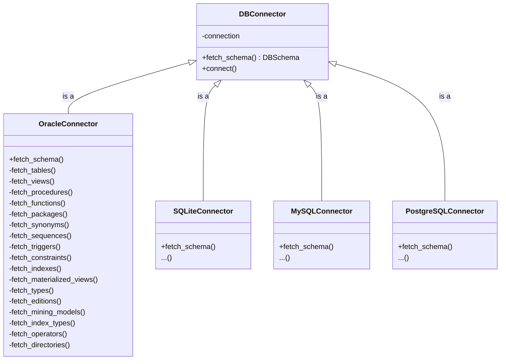

```mermaid
---
config:
    class:
        hideEmptyMembersBox: true
---

classDiagram
    class DBConnector {
        -connection
        +fetch_schema() DBSchema
        +connect()
    }

    class OracleConnector {
        +fetch_schema()
        -fetch_tables()
        -fetch_views()
        -fetch_procedures()
        -fetch_functions()
        -fetch_packages()
        -fetch_synonyms()
        -fetch_sequences()
        -fetch_triggers()
        -fetch_constraints()
        -fetch_indexes()
        -fetch_materialized_views()
        -fetch_types()
        -fetch_editions()
        -fetch_mining_models()
        -fetch_index_types()
        -fetch_operators()
        -fetch_directories()
    }
    DBConnector <|-- OracleConnector: is a

    class SQLiteConnector {
        +fetch_schema()
        ...()
    }
    DBConnector <|-- SQLiteConnector: is a

    class MySQLConnector {
        +fetch_schema()
        ...()
    }
    DBConnector <|-- MySQLConnector: is a

    class PostgreSQLConnector {
        +fetch_schema()
        ...()
    }
    DBConnector <|-- PostgreSQLConnector: is a

```